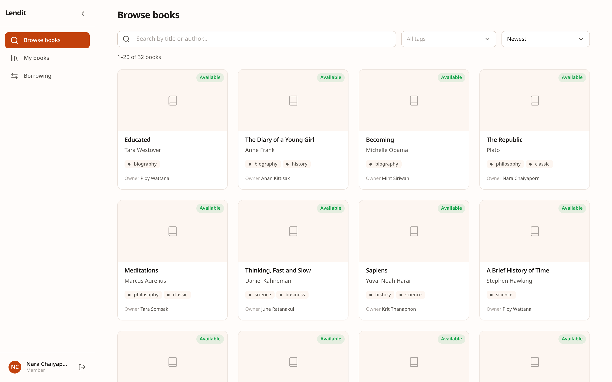
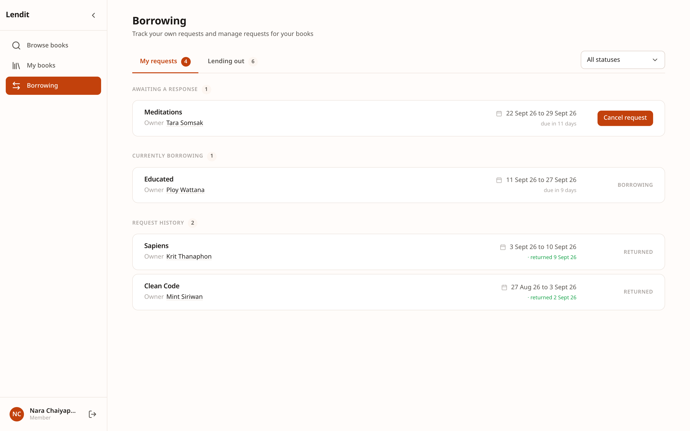
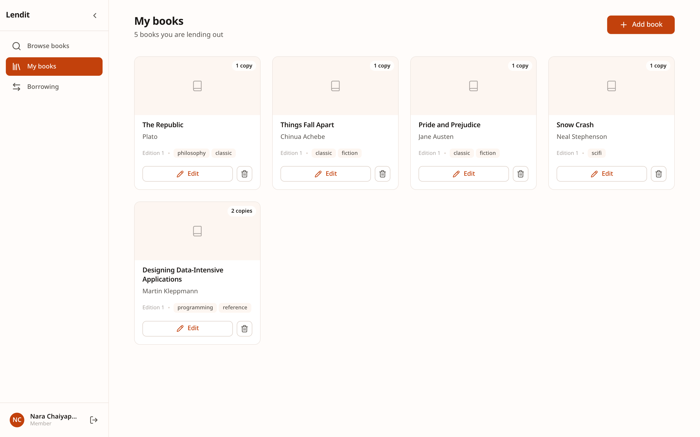
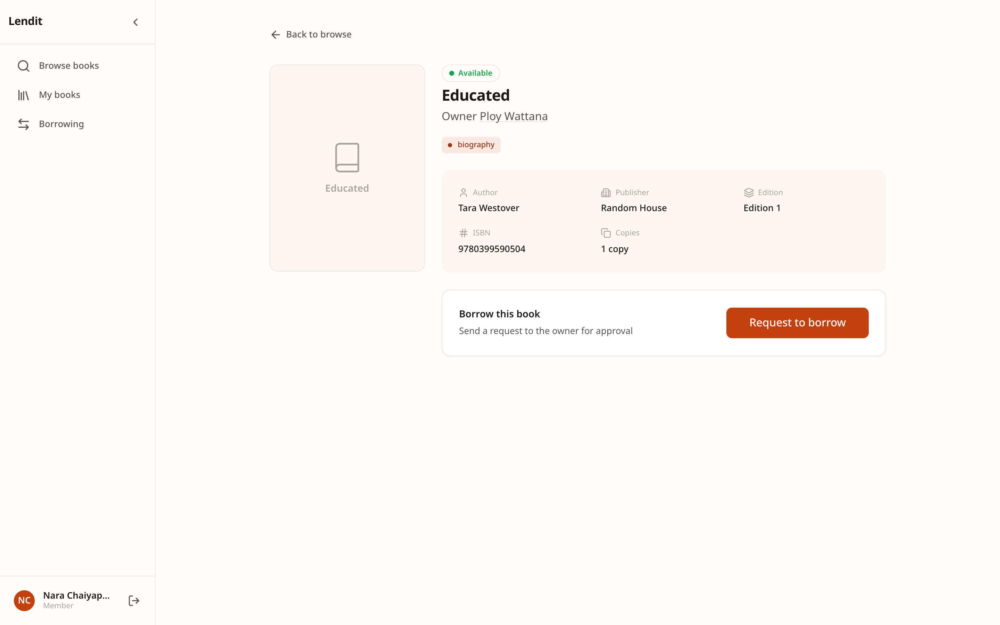
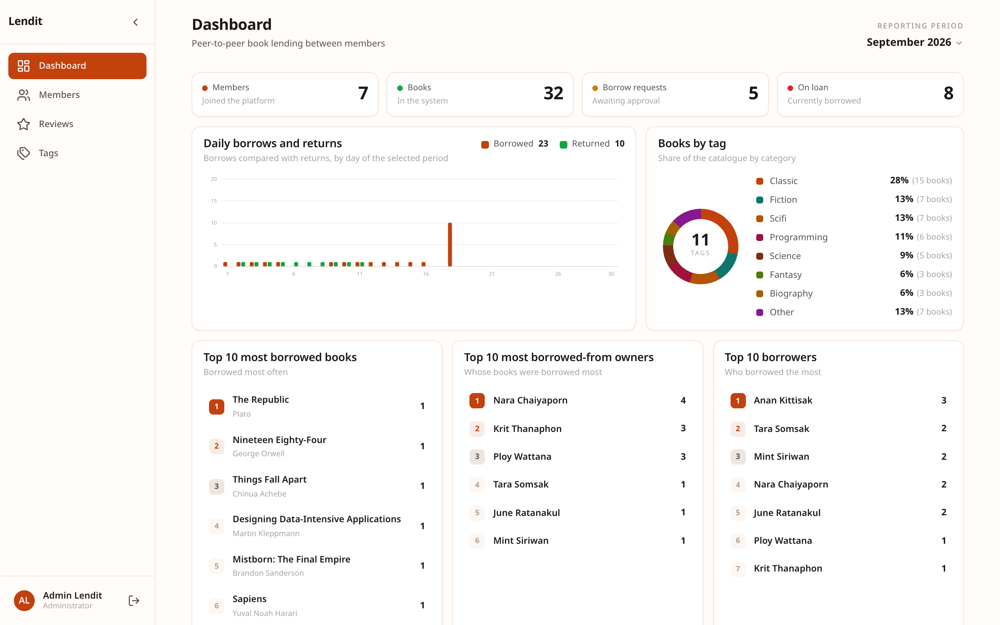
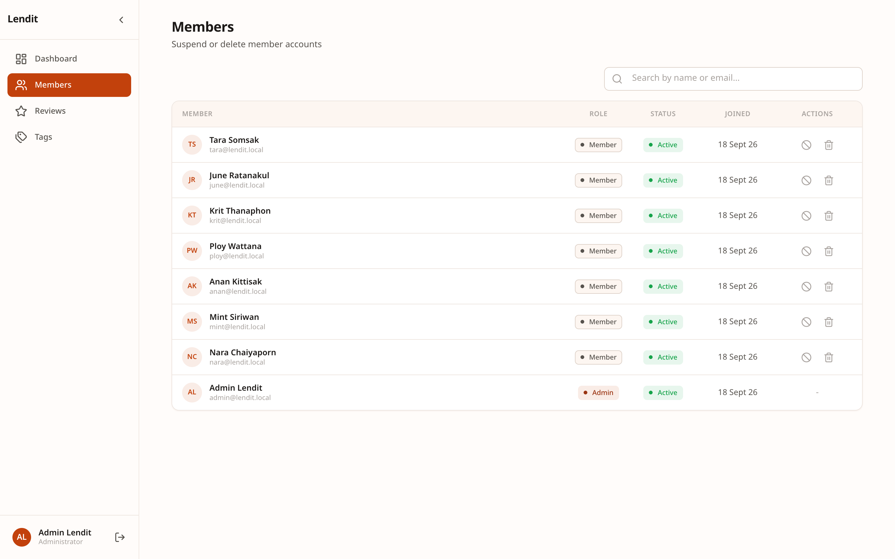
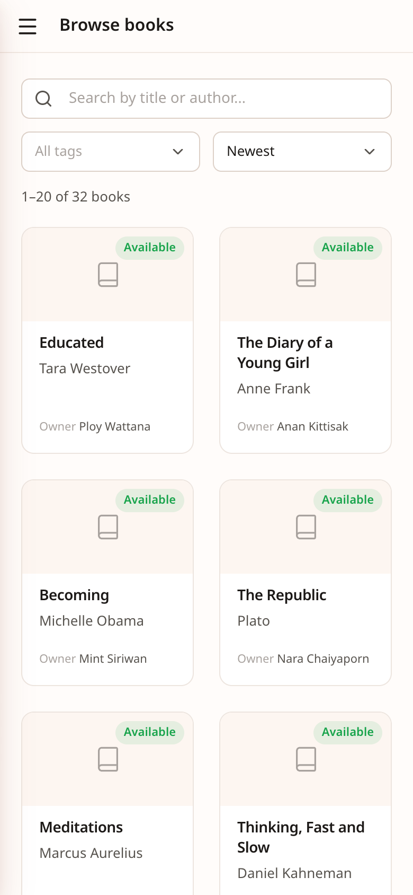

# Lendit

A book lending library for a group of people who already know each other: a
team, a department, a book club. Members list the books they own, borrow each
other's, and review each other afterwards.

It handles the awkward parts of lending between people: whether a copy is free
for a given week, who still owes what, and what each side thought of the other
once the book came back.



## Contents

| | |
| --- | --- |
| [`lendit-backend`](lendit-backend) | REST API. Bun, Elysia, MongoDB, TypeScript |
| [`lendit-frontend`](lendit-frontend) | Web client. Vue 3, Vite, TypeScript |

Each half has its own README with the detail. The API runs on its own; the
client is useless without it.

## Running both

The API first, since nothing in the client loads without it. It needs MongoDB
**as a replica set**, because approvals and deletions run in transactions:

```bash
mongod --replSet rs0 --dbpath /your/data/path
mongosh --eval 'rs.initiate()'
```

```bash
cd lendit-backend
bun install
cp .env.example .env      # set MONGODB_URI and a real JWT_SECRET
bun run create-admin      # makes the first admin account
bun run dev               # http://localhost:3000
```

```bash
cd lendit-frontend
bun install
bun run dev               # http://localhost:5173
```

The client defaults to the API's own address, so a local setup needs no
configuration. Sign up from the app to get a member account.

## What it does

### Borrowing is a conversation, not a switch

A book carries a number of copies, and availability is worked out per date
range rather than as one in/out flag. Someone requests a book for a set of
dates, the owner approves or declines, and approval is atomic: it re-checks
availability at that moment and automatically rejects the pending requests it
just filled up.

Both sides of every loan live on one page: what you have asked for, and what
people have asked of you.



### Your own shelf

Add the books you are willing to lend, with however many copies you own.



### Reviews that go both ways

After a return, each side may rate the other once, within seven days. Reviews
are attached to the loan they came from, so a profile shows what someone is
like as a lender and as a borrower separately.



### Admin

Admins manage the catalogue and moderate reviews, and do not borrow; the
member pages are guarded, not merely hidden. The dashboard reports on any
month.



Members can be suspended, which hides them from public views and drops their
reviews out of everyone else's averages, without deleting anything.



### On a phone



## How it is built

**API:** routes, controllers, repositories and validators are kept apart, so
every database query lives in one layer and every rule in another. Sessions are
JWTs that can be revoked server-side. Two scheduled jobs clean up after people:
requests that go stale are auto-rejected, and overdue loans auto-returned.

**Client:** one file per route, one composable per API resource, and a small
set of `L*` primitives that everything else is built from. Every colour, size
and radius is a token in `styles/tokens.css`. All UI copy lives in
`locales/en.json` rather than in templates, so a second language means adding
one file.

Both sides are TypeScript, both typecheck as part of their build, and both
install with Bun, so there is one toolchain across the pair.
